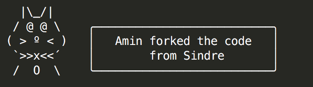

# begoo [](https://badge.fury.io/js/begoo)[](https://travis-ci.org/shariati/begoo)[](https://coveralls.io/github/shariati/begoo?branch=master)

> Say Something with style ;), It's basically whatever yosay provides plus extra avatars. 
> will be working on this to add more ascii characters.
> Feel free suggest what would you like to see in the next update I'll try my best to add it.

Like [yosay](https://github.com/yeoman/yosay), with some avatars. Special thanks to [sindresorhus] for creating such an awesome script.




## Install

```
$ npm install --save begoo
```


## Usage

```js
const begoo = require('begoo');

console.log(begoo('Welcome to Begoo! \n Meow ...'));

/*
     |\_/|     
    / @ @ \    ╭──────────────────────────╮
   ( > º < )   │     Welcome to Begoo!    │
    `>>x<<´    │         Meow ...         │
    /  O  \    ╰──────────────────────────╯

 */
```

*You can style your text with [chalk](https://github.com/sindresorhus/chalk) before passing it to `begoo`.*


## CLI

```
$ npm install --global begoo
```

```
$ begoo --help

  Usage
    begoo <string>
    begoo <string> --maxLength 8
    begoo <string> --avatar name
      Available names: cat, dog, chicken, monkey and tux
    echo <string> | begoo

  Example
    begoo 'Amin forked the code from yosay'

     |\_/|     
    / @ @ \    ╭──────────────────────────╮
   ( > º < )   │   Amin forked the code   │
    `>>x<<´    │        from yosay        │
    /  O  \    ╰──────────────────────────╯


    begoo 'Bark Bark' --avatar 'dog'

             __        
            /  \      
           / ..|\     ╭──────────────────────────╮
          (_\  |_)    │         Bark Bark        │
          /  \@'      ╰──────────────────────────╯
         /     \      
    _   /  `   |       
    \\/  \  | _\   
     \   /_ || \\_  
      \____)|_) \_)  


    begoo 'Its a chicken and egg situation' --avatar 'chicken'


      \\     
      (o>    ╭──────────────────────────╮
   \\_//)    │   Its a chicken and egg  │
    \_/_)    │         situation        │
     _|_     ╰──────────────────────────╯

```


## License

[BSD license](http://opensource.org/licenses/bsd-license.php)